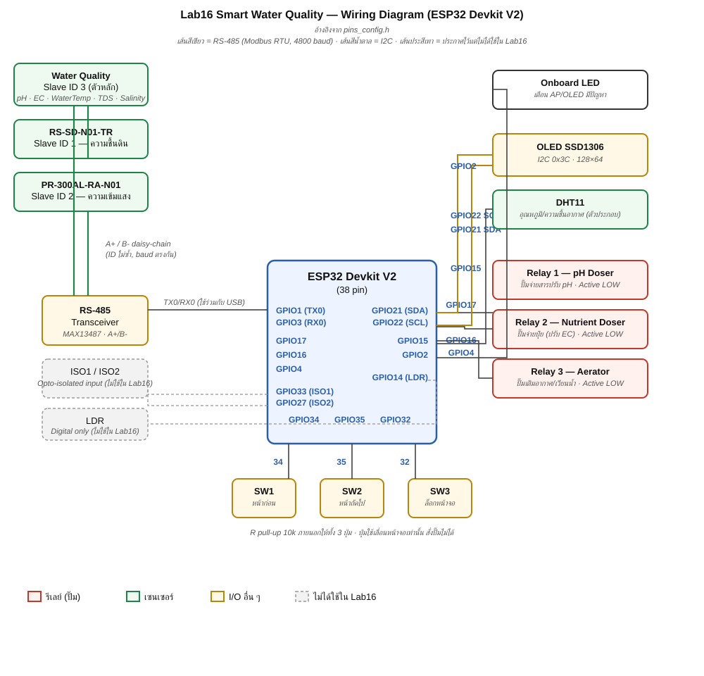

# Lab16 Smart Water Quality (ESP32)

ระบบเฝ้าระวังและปรับคุณภาพน้ำอัตโนมัติด้วยบอร์ด **ESP32 Devkit V2** (3 Relay + OLED + RS-485)
พัฒนาต่อจาก Lab15 (Smart Farm) แต่ตัดเรื่องอื่นออกและยก **คุณภาพน้ำเป็นตัวหลักของระบบ**

วัดค่า pH / EC / อุณหภูมิน้ำ / TDS / ความเค็ม ผ่านเซนเซอร์ Modbus RTU บนสาย RS-485
ตัดสินคุณภาพน้ำเป็น 3 ระดับ (**ดี / เฝ้าระวัง / ผิดปกติ**) แล้วควบคุมรีเลย์ 3 ตัวให้ปรับน้ำอัตโนมัติ
ดูผลได้ทั้งจอ OLED, หน้าเว็บ Dashboard (captive portal) และ MQTT

## โครงสร้างไฟล์

| ไฟล์ | หน้าที่ |
|---|---|
| `Lab16_SmartWaterQuality.ino` | โค้ดหลัก ~1,800 บรรทัด |
| `pins_config.h` | แผนผังขา GPIO ของบอร์ด |
| `dashboard_html.h` | หน้าเว็บ Dashboard เก็บใน PROGMEM |
| `fonts_data.h` | ฟอนต์ Prompt แบบ woff2 ฝังใน flash (~62 KB) ให้หน้าเว็บอ่านไทยได้แม้ไม่มีเน็ต |
| `secrets.h.example` | แม่แบบค่า WiFi/MQTT — คัดลอกเป็น `secrets.h` แล้วแก้เป็นค่าจริงของตัวเอง |

## ฮาร์ดแวร์และเซนเซอร์

### Wiring Diagram

### ขา GPIO ทั้งหมดที่ใช้งาน (จาก `pins_config.h`)

| GPIO | ชื่อในโค้ด | ใช้กับ | หมายเหตุ |
|---|---|---|---|
| 1 (TX0) / 3 (RX0) | `RS485` (= `Serial` / UART0) | RS-485 → เซนเซอร์ Modbus 3 ตัว | ใช้ร่วมกับพอร์ต USB ต้อง**ถอดสาย A+/B- ก่อนอัปโหลดทุกครั้ง** ห้าม `Serial.print()` |
| 2 | `LED_PIN` | LED บนบอร์ด | กะพริบเตือนตอนจอ OLED หรือ WiFi AP มีปัญหา |
| 4 | `RELAY3_PIN` | รีเลย์ R3 — Aerator (ปั๊มเติมอากาศ) | Active LOW |
| 14 | `LDR_PIN` | ช่องเสียบ LDR (แสง, digital input) | ประกาศไว้ใน `pins_config.h` แต่**ไม่ได้ใช้ใน Lab16** — เป็น ADC2 ซึ่งชนกับ WiFi ถ้าเปิด WiFi จะ `analogRead()` ไม่ได้ |
| 15 | `DHT_PIN` | DHT11 — อุณหภูมิ/ความชื้นอากาศ | ตัวประกอบ ไม่ได้อยู่บนสาย RS-485 |
| 16 | `RELAY2_PIN` | รีเลย์ R2 — Nutrient Doser (ปั๊มจ่ายปุ๋ย) | Active LOW |
| 17 | `RELAY1_PIN` | รีเลย์ R1 — pH Doser (ปั๊มจ่ายสารปรับ pH) | Active LOW |
| 21 | `I2C_SDA` | จอ OLED (I2C) | ที่อยู่ I2C `0x3C` |
| 22 | `I2C_SCL` | จอ OLED (I2C) | ขนาดจอ 128×64 |
| 27 | `ISO2_PIN` | Opto-isolated input เทอร์มินัล IN2 | ประกาศไว้แต่**ไม่ได้ใช้ใน Lab16** (Lab15 ใช้เป็นลูกลอยตรวจน้ำแห้ง — Lab16 ตัดออก) |
| 32 | `SW3_PIN` | ปุ่มกด SW3 — สลับเปิด/ปิดหมุนหน้าจออัตโนมัติ | มี pull-up ภายในได้ แต่บอร์ดมี R ภายนอกให้แล้ว |
| 33 | `ISO1_PIN` | Opto-isolated input เทอร์มินัล IN1 | ประกาศไว้แต่**ไม่ได้ใช้ใน Lab16** |
| 34 | `SW1_PIN` | ปุ่มกด SW1 — เลื่อนหน้าจอก่อนหน้า | input-only ไม่มี pull-up ภายใน (มี R ภายนอกให้แล้ว) |
| 35 | `SW2_PIN` | ปุ่มกด SW2 — เลื่อนหน้าจอถัดไป | input-only ไม่มี pull-up ภายใน (มี R ภายนอกให้แล้ว) |

> ปุ่ม SW1–SW3 ใช้ **เลื่อนหน้าจอเท่านั้น** ตั้งใจไม่ให้กดสั่งปั๊มได้ เพราะปุ่มอยู่หน้าตู้ที่คนเดินผ่านกดเล่นได้
> การสั่งงานจริงต้องทำผ่านหน้าเว็บหรือ MQTT ซึ่งเห็นบริบทครบก่อนกดเสมอ

### เซนเซอร์ Modbus RTU บนสาย RS-485 (Slave ID)

เซนเซอร์ทั้ง 3 ตัวอยู่บนสาย RS-485 เส้นเดียว (ใช้ฟังก์ชัน `0x03 Read Holding Registers` ทุกตัว)
**ต้องตั้ง Slave ID ไม่ซ้ำกัน** และ baud การสื่อสารจริงทั้งสายคือ **4800**:

| Slave ID | เซนเซอร์ | รีจิสเตอร์เริ่ม | จำนวนรีจิสเตอร์ | ค่าที่อ่าน / ตัวหาร |
|---|---|---|---|---|
| **3** | Water Quality (**ตัวหลักของระบบ**) | `0x0000` | 5 (อ่านรวดเดียว) | pH ÷100 · EC ÷10 (µS/cm) · อุณหภูมิน้ำ ÷10 (°C, signed) · TDS ÷10 · ความเค็ม ÷10 |
| 1 | RS-SD-N01-TR | `0x0000` | 1 | ความชื้นดิน ÷10 (%) — ตัวประกอบ |
| 2 | PR-300AL-RA-N01 | `0x0003` | 1 | ความเข้มแสงอาทิตย์ (W/m², ค่าจริงไม่ต้องหาร) — ตัวประกอบ |

#### รายละเอียด register แต่ละตัว

**1) Water Quality — Slave ID 3 (ตัวหลัก)**

อ่านต่อเนื่อง 5 รีจิสเตอร์จาก `0x0000` ในครั้งเดียว (ประหยัดเวลาบนสาย RS-485):

| Offset จาก `0x0000` | ชื่อค่า | ตัวหาร | หน่วย | หมายเหตุ |
|---|---|---|---|---|
| +0 | pH | ÷ 100 | — | |
| +1 | EC (ค่าการนำไฟฟ้า) | ÷ 10 | µS/cm | |
| +2 | อุณหภูมิน้ำ | ÷ 10 | °C | **ค่ามีเครื่องหมาย (signed)** — คู่มือระบุ 16-bit one's complement แต่อุปกรณ์จริงใช้ two's complement (`int16_t` อ่านตรงได้) ค่าบวกให้ผลเหมือนกันทั้งสองแบบ ต่างกันเฉพาะค่าติดลบ ~0.1°C |
| +3 | TDS | ÷ 10 | ppm | |
| +4 | ความเค็ม (Salinity) | ÷ 10 | ppt | |

รีจิสเตอร์ตั้งค่า (ใช้เฉพาะโหมด Commissioning ตอนติดตั้งใหม่):

| รีจิสเตอร์ | หน้าที่ | ค่าที่ใช้ |
|---|---|---|
| `0x0030` | ตั้ง Slave ID | เขียนเลข ID ใหม่ (เช่น 3) |
| `0x0031` | ตั้ง Baud rate | เขียนค่า baud ตรง ๆ เช่น `4800` |

> Baud จากโรงงานคือ **9600** โหมด Commissioning (`COMMISSION_MODE = 3`) จะเปลี่ยนให้เป็น Slave ID 3 และ baud 4800 ให้ตรงกับสายรวม

**2) RS-SD-N01-TR (ความชื้นดิน) — Slave ID 1**

| Offset | ชื่อค่า | ตัวหาร | หน่วย | หมายเหตุ |
|---|---|---|---|---|
| `0x0000` | ความชื้นดิน | ÷ 10 | % | ยืนยันจากการทดสอบจริงใน Lab11 — **ไม่ตรงกับคู่มือถึง 2 จุด**: เครื่องจริงใช้รีจิสเตอร์ `0x0000` (คู่มือเขียน `0x0001`) และตัวหารจริงคือ 10 (คู่มือเขียนหาร 100) |

**3) PR-300AL-RA-N01 (ความเข้มแสง) — Slave ID 2**

| Offset | ชื่อค่า | ตัวหาร | หน่วย | หมายเหตุ |
|---|---|---|---|---|
| `0x0003` | ความเข้มแสงอาทิตย์ | ไม่หาร (÷1) | W/m² | คู่มือระบุว่าเป็น "actual value" อยู่แล้ว |

รีจิสเตอร์ตั้งค่า (ใช้เฉพาะโหมด Commissioning):

| รีจิสเตอร์ | หน้าที่ | ค่าที่ใช้ |
|---|---|---|
| `0x07D0` | ตั้ง Slave ID | เขียนเลข ID ใหม่ (เช่น 2) |
| `0x07D1` | ตั้ง Baud rate | `0` = 2400 · `1` = 4800 · `2` = 9600 |

> โหมด Commissioning (`COMMISSION_MODE = 2`) คุยกับเซนเซอร์นี้ที่ baud โรงงาน 4800 อยู่แล้ว จึงตั้งแค่ Slave ID ให้เป็น 2

**หมายเหตุการอ่านบนสายจริง:** ระบบอ่านทีละตัววนรอบ (round-robin) ทุก 2 วินาที ไม่อ่านทั้ง 3 ตัวพร้อมกัน เพราะถ้าตัวใดไม่ตอบ `ModbusMaster` จะรอ timeout ถึง 2 วินาที และถ้าอ่านรวดเดียวทั้ง 3 ตัวที่ไม่ตอบเลยจะบล็อกระบบถึง 6 วินาที

และ **DHT11** (GPIO15) วัดอุณหภูมิ/ความชื้นอากาศแยกนอกสาย RS-485 ไม่มี Slave ID เพราะไม่ใช่ Modbus

### รีเลย์ 3 ตัว (Active LOW)

| รีเลย์ | GPIO | บทบาท |
|---|---|---|
| R1 | 17 | pH Doser — ปั๊มจ่ายสารปรับ pH (กรด/เบส) |
| R2 | 16 | Nutrient Doser — ปั๊มจ่ายปุ๋ย ปรับค่า EC |
| R3 | 4 | Aerator — ปั๊มเติมอากาศ/เวียนน้ำ |

ปั๊มจ่ายสารเคมีอันตรายกว่าปั๊มน้ำทั่วไปมาก จ่ายเกินไม่กี่นาทีก็ทำให้น้ำเสียทั้งถังได้
จึงตั้งเวลาตัดอัตโนมัติของโหมดสั่งเองไว้สั้นเพียง **2 นาที**

## ⚠️ ข้อจำกัดสำคัญของบอร์ดนี้

RS-485 ใช้ **UART0 (GPIO1/GPIO3) ร่วมกับพอร์ต USB** จึงไม่มีคำสั่ง `Serial.print()` เลยในโปรแกรม
ช่องทางดูสถานะมีแค่ 3 ทาง: จอ OLED / หน้าเว็บ Dashboard / MQTT
และ **ต้องถอดสาย A+/B- ออกก่อนอัปโหลดโปรแกรมทุกครั้ง**

## การทำงานของระบบ

- **`loop()` แบบไม่บล็อก**: แบ่งงานเป็น task ย่อยจับเวลาด้วย `millis()` — DNS, Web, WiFi STA, MQTT, NTP, DHT, Modbus, ปุ่ม, ควบคุมรีเลย์, failsafe, publish, จอ
- **อ่าน Modbus ทีละตัววนรอบทุก 2 วินาที**: กันไม่ให้ timeout ของเซนเซอร์ที่ไม่ตอบ (นานถึง 2 วินาที/ตัว) รวมกันบล็อกระบบถึง 6 วินาทีถ้าอ่านพร้อมกันหมด
- **โหมดจำลอง (Simulation)**: ถ้าอ่านพลาดติดกัน 3 ครั้ง ระบบสร้างค่าจำลองแทนโดยอัตโนมัติ ค่าจำลองแกว่งรอบค่ากลางอย่างมีเหตุผลและตอบสนองต่อรีเลย์จริง (เช่น เปิดปั๊มปุ๋ยแล้ว EC เพิ่มขึ้น) ทำให้ทดสอบตรรกะควบคุมได้ครบไม่ต้องมีเซนเซอร์จริง — ทุกค่ามีธงบอกว่าเป็น `real` หรือ `sim`
- **ตัดสินคุณภาพน้ำ 3 ระดับ**: GOOD / WATCH / BAD จากเกณฑ์ของ pH, EC, อุณหภูมิน้ำ — ผลรวมทั้งระบบใช้ค่าที่แย่ที่สุดของทั้งสามตัว
- **รีเลย์ควบคุมได้ 3 โหมด**:
  - **Manual** — สั่งเปิด/ปิดเอง ตัดอัตโนมัติเมื่อครบ 2 นาที
  - **Schedule** — ทำงานตามเวลาจริงที่ซิงค์จาก NTP
  - **Auto** — เปิด/ปิดตามเกณฑ์ (threshold) พร้อมช่วงหน่วง (hysteresis) กันเปิด-ปิดรัว
- **เครือข่าย**: บอร์ดปล่อย WiFi AP ชื่อ `WaterQual-xxxx` พร้อม captive portal (เชื่อมแล้วหน้าเว็บเด้งขึ้นเอง) ใช้ร่วมกับต่อ WiFi บ้าน (STA) ได้พร้อมกัน เปิดที่ `waterqual.local` (mDNS) ได้ในวง STA และส่งข้อมูลออก MQTT
- **Web API**: `/api/status` (อ่านค่าทั้งหมด), `/api/relay` (สั่งรีเลย์), `/api/config` (ตั้งเกณฑ์อัตโนมัติ/ตารางเวลา), `/api/history` (ประวัติย้อนหลัง), `/api/export` (ดาวน์โหลด CSV)
- **จอ OLED 8 หน้า** หมุนอัตโนมัติทุก 5 วินาที (ปุ่ม SW3 ล็อกได้) แต่ละหน้ามีสเกลแสดงตำแหน่งค่าปัจจุบันเทียบกับช่วงที่เหมาะสม และมีข้อความเตือนกะพริบเมื่อคุณภาพน้ำผิดปกติ
- **บันทึกค่าตั้งลง NVS**: บันทึกเฉพาะตอนกดบันทึกเท่านั้น (กัน flash เขียนซ้ำเกิน) และบูตใหม่ทุกครั้งจะบังคับให้รีเลย์ทุกตัวเริ่มที่ OFF เพื่อความปลอดภัย
- **บันทึกประวัติเซนเซอร์ทุก 15 นาที (LittleFS)**: ดูรายละเอียดในหัวข้อถัดไป

## ประวัติเซนเซอร์ย้อนหลัง + Export

ระบบบันทึกค่าเซนเซอร์ทุกตัว (อุณหภูมิ/ความชื้นอากาศ, แสงอาทิตย์, pH, EC, อุณหภูมิน้ำ, TDS, ความเค็ม, คำตัดสินคุณภาพน้ำ, สถานะรีเลย์ 3 ตัว) ลง **LittleFS** (พื้นที่ในตัวชิป ESP32 เอง ไม่ต้องมีการ์ด SD เพิ่ม) เป็นไฟล์ `/history.csv` หนึ่งไฟล์

- **บันทึกทุก 15 นาที** (`LOG_INTERVAL_MS`) — ถี่กว่านี้จะทำให้ flash สึกเร็วเกินจำเป็น และบันทึก 1 แถวทันทีตอนบูตเครื่องให้เห็นข้อมูลได้เลยโดยไม่ต้องรอ
- **เก็บสูงสุด 700 แถว** (`LOG_MAX_ROWS`, ประมาณ 7 วัน) แถวเก่าสุดถูกตัดทิ้งอัตโนมัติเมื่อเกิน กันไฟล์โตไม่หยุด
- **Dashboard** มีการ์ด "ข้อมูลย้อนหลัง" แสดงตารางแถวล่าสุด (สูงสุด 100 แถว, `HISTORY_VIEW_MAX`) พร้อมสีคำตัดสิน (ดี/เฝ้าระวัง/ผิดปกติ) อัปเดตอัตโนมัติทุก 1 นาที
- **ปุ่ม "ดาวน์โหลด Excel (.csv)"** ดึงไฟล์ `/history.csv` ทั้งไฟล์ (ไม่ตัดแถวเหมือนตารางบนเว็บ) — ไฟล์เป็น **CSV** ที่ Excel เปิดได้ตรง ๆ ทันที เพราะ ESP32 ไม่มีไลบรารีสร้างไฟล์ `.xlsx` (รูปแบบ binary/zip) จริงจึงไม่สร้างไฟล์ปลอมที่เสี่ยงเปิดไม่ได้

### Web API เพิ่มเติม

| Endpoint | หน้าที่ |
|---|---|
| `GET /api/history` | คืนค่า JSON ประวัติล่าสุดสูงสุด 100 แถว ใช้วาดตารางบนเว็บ |
| `GET /api/export`  | ดาวน์โหลดไฟล์ `waterquality_history.csv` ทั้งไฟล์ (`Content-Disposition: attachment`) |

### ⚠️ ต้องเลือก Partition Scheme ที่มีพื้นที่ไฟล์ระบบก่อนอัปโหลด

`LittleFS.begin(true)` ต้องการพาร์ทิชันสำหรับไฟล์ระบบ (ประเภทเดียวกับที่ SPIFFS ใช้) ถ้าไม่มีจะ mount ไม่สำเร็จและ**ข้ามการบันทึกประวัติทั้งหมดโดยอัตโนมัติ (ไม่ค้าง ไม่ crash)** ระบบหลักยังทำงานปกติ แต่จะไม่มีข้อมูลย้อนหลัง

แก้โดยไปที่ **Arduino IDE → Tools → Partition Scheme** แล้วเลือกอันที่มีคำว่า `spiffs` เช่น *"Default 4MB with spiffs"* (ค่าเริ่มต้นของบอร์ด ESP32 ส่วนใหญ่มีอยู่แล้ว)

## เริ่มใช้งาน

1. คัดลอก `secrets.h.example` เป็น `secrets.h` แล้วแก้ SSID/รหัสผ่าน WiFi และ MQTT topic base ของตัวเอง
   (ไฟล์ `secrets.h` ถูกกันไว้ใน `.gitignore` ไม่ขึ้น GitHub)
2. ติดตั้งไลบรารี: `PubSubClient`, `ModbusMaster`, `DHT sensor library`,
   `Adafruit Unified Sensor`, `Adafruit SSD1306`, `Adafruit GFX Library`
   (`LittleFS` มากับ ESP32 core อยู่แล้ว ไม่ต้องติดตั้งเพิ่ม)
3. ตรวจสอบ **Tools → Partition Scheme** ให้เป็นแบบที่มี `spiffs` (ดูหัวข้อด้านบน) ไม่งั้นฟีเจอร์ประวัติย้อนหลังจะไม่ทำงาน
4. **ถอดสาย RS-485 A+/B- ออกก่อนอัปโหลดโปรแกรมทุกครั้ง**
5. อัปโหลดขึ้นบอร์ด ESP32 Devkit V2 แล้วต่อ WiFi ชื่อ `WaterQual-xxxx` (รหัสตาม `SECRET_AP_PASS`) เพื่อเปิด Dashboard — ถ้าไม่เด้งเอง เปิด `http://192.168.4.1`

## ⚠️ ความปลอดภัยและข้อควรระวัง

- หน้าเว็บไม่มีระบบล็อกอิน และ MQTT broker สาธารณะ (`broker.hivemq.com`) ไม่มีการยืนยันตัวตน — **ใช้ในเครือข่ายภายในเท่านั้น ห้ามเปิด port ออกอินเทอร์เน็ตโดยตรง**
- ปั๊มจ่ายสารเคมี (pH/ปุ๋ย) อันตรายกว่าปั๊มน้ำทั่วไป ตรวจสอบเกณฑ์ให้ถูกต้องก่อนต่อปั๊มจริงเสมอ
- โหมด Auto อ่านค่าจากตัวแปรเดียวกับค่าจำลอง หากเซนเซอร์คุณภาพน้ำ (ID 3) หลุด ระบบจะสั่งปั๊มตามค่าจำลองต่อไปโดยไม่รู้ตัว ควรตรวจสอบธง `real/sim` ก่อนเชื่อผลจากโหมด Auto ในสถานการณ์จริง
